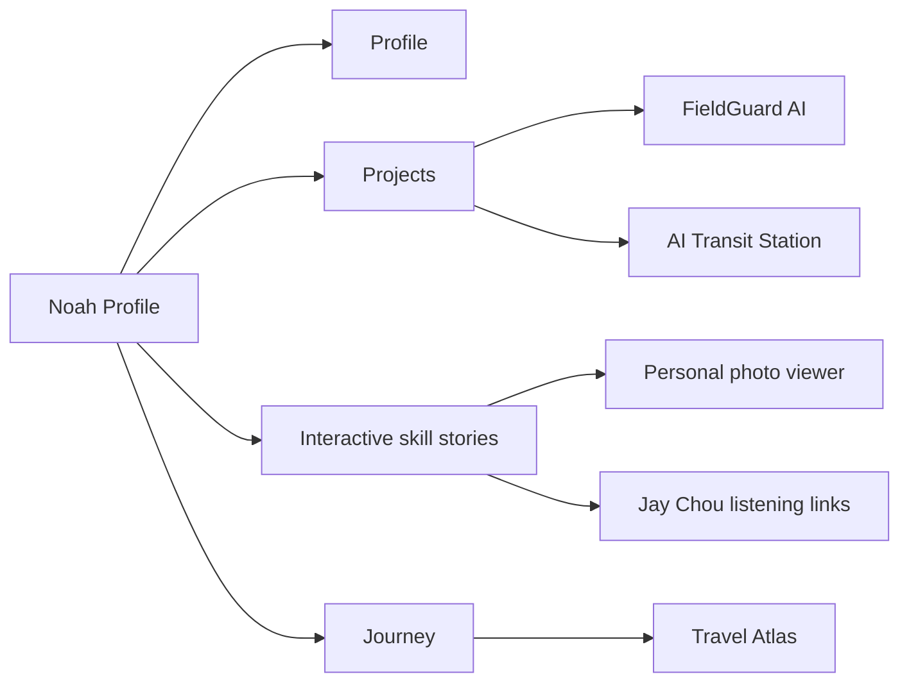

# Noah Xu · Interactive Profile

[](https://www.noahxu.org/)
[](https://www.noahxu.org/travel)


An image-led personal profile for Noah Xu — a Macau student developer exploring MO, OI, AI, robotics, tennis, Go, violin and the world.

> 桃李春风一杯酒，江湖夜雨十年灯。<br>
> What doesn’t kill you makes you stronger.

## Explore

| Area | Experience |
| --- | --- |
| Profile | Personal introduction, goals and three-language switching |
| Projects | 濠江通, robotics, FieldGuard AI and AI Transit Station |
| Skills | Interactive photo stories for MO/IMSC, tennis, Go, violin and music |
| Journey | Robotics lab, milestones and campus memories |
| Travel | Abroad, China/outdoors and university chapters with animated landscapes |

## Visual site map



## Featured project showcases

- [FieldGuard AI](https://github.com/noah200910070082-dotcom/fieldguard-ai) — a computer-vision field monitoring concept.
- [AI Transit Station](https://github.com/noah200910070082-dotcom/ai-transit-station) — a visual hub for routing useful AI capabilities.
- [濠江通 · Sports Day Assistant](https://houkong.up.railway.app) — a practical school sports-day operations tool.

These repositories are presented as showcases on the profile site; this repository does not modify their source code.

## Local development

```bash
npm install
npm run dev
```

Open the local URL printed by Astro. The homepage is `/`, and the dedicated atlas is `/travel`.

## Verification

```bash
npm run test:profile
npm run check
npm run build
```

`test:profile` checks required content, project links, travel scenes and stable image assets. `check` validates Astro and TypeScript, while `build` creates the production-ready static site in `dist/`.

## Deployment

The site is static and can be deployed through Vercel, Netlify, Cloudflare Pages or GitHub Pages. The production domain is [www.noahxu.org](https://www.noahxu.org/). When reconnecting the domain, preserve existing email-related MX and TXT records.

---

Built with Astro, plain CSS and a curious amount of motion in Macau.
