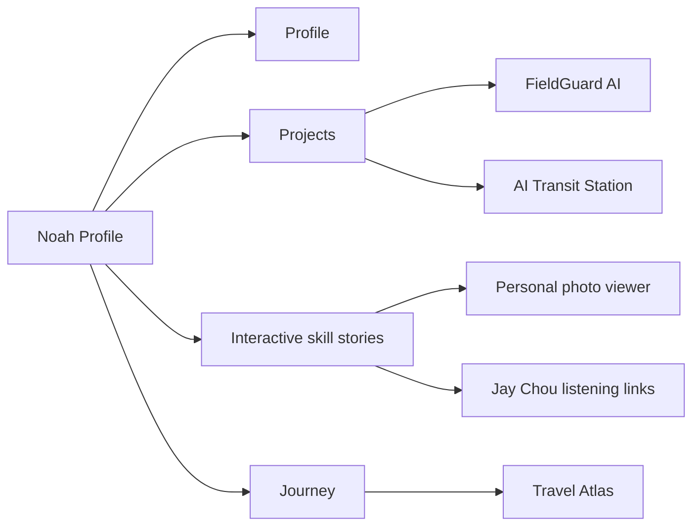

# Interactive Portfolio Enhancement Implementation Plan

> **For agentic workers:** REQUIRED SUB-SKILL: Use superpowers:subagent-driven-development (recommended) or superpowers:executing-plans to implement this plan task-by-task. Steps use checkbox (`- [ ]`) syntax for tracking.

**Goal:** Upgrade Noah's existing portfolio with image-led skill stories, dynamic landscape travel transitions, two GitHub project showcases, and a visual repository README.

**Architecture:** Preserve the current Astro page structure and reuse its existing interaction patterns. Homepage skill cards share one modal viewer driven by `data-*` attributes, while the travel page gains self-contained transition sections driven by CSS custom properties and a small scroll/pointer script. A Node verification script provides repeatable static contract checks alongside Astro's compiler and production build.

**Tech Stack:** Astro 7, TypeScript in Astro scripts, plain CSS, Astro Image, Node.js verification script, GitHub-flavored Markdown/Mermaid.

---

## File Structure

- Create `src/assets/skills/`: stable copies of the supplied tennis, Go, violin, and music photos.
- Add two Washington, D.C. images to `src/assets/travel/`.
- Modify `src/pages/index.astro`: imports, skills card markup, project cards, skill viewer, and interaction script.
- Modify `src/styles/global.css`: new skill image hierarchy, modal, and project visualization styles.
- Modify `src/pages/travel.astro`: Washington cards, two dynamic landscape separators, and parallax state.
- Create `scripts/verify-profile.mjs`: static assertions for required content and links.
- Modify `package.json`: expose `npm run test:profile`.
- Replace `README.md`: visual repository introduction and Mermaid map.

### Task 1: Add Static Contract Verification

**Files:**
- Create: `scripts/verify-profile.mjs`
- Modify: `package.json`

- [ ] **Step 1: Write the failing verification script**

Create a Node script that reads the homepage, travel page, README, and assets directory. It must assert these exact contracts:

```js
import { access, readFile } from 'node:fs/promises';

const read = (path) => readFile(path, 'utf8');
const expectText = (source, value, label) => {
  if (!source.includes(value)) throw new Error(`${label}: missing ${value}`);
};

const index = await read('src/pages/index.astro');
const travel = await read('src/pages/travel.astro');
const readme = await read('README.md');

[
  'data-skill-story="tennis"',
  'data-skill-story="go"',
  'data-skill-story="violin"',
  'data-skill-story="imsc"',
  'data-skill-story="music"',
  'https://github.com/noah200910070082-dotcom/fieldguard-ai',
  'https://github.com/noah200910070082-dotcom/ai-transit-station',
  'https://www.youtube.com/results?search_query=',
].forEach((value) => expectText(index, value, 'homepage'));

['travel-landscape-divider', 'WASHINGTON, D.C.', 'data-landscape-depth'].forEach((value) =>
  expectText(travel, value, 'travel page'),
);

['```mermaid', 'FieldGuard AI', 'AI Transit Station', 'https://www.noahxu.org/travel'].forEach((value) =>
  expectText(readme, value, 'README'),
);

await Promise.all([
  'src/assets/skills/tennis-medal.jpg',
  'src/assets/skills/tennis-team.jpg',
  'src/assets/skills/tennis-championship.jpg',
  'src/assets/skills/violin-portrait.jpg',
  'src/assets/skills/go-ranking-event.jpg',
  'src/assets/skills/music-concert.jpg',
  'src/assets/travel/abroad-washington-hotel.jpg',
  'src/assets/travel/abroad-washington-monument.jpg',
].map(access));

console.log('Profile contracts verified.');
```

Add to `package.json`:

```json
"test:profile": "node scripts/verify-profile.mjs"
```

- [ ] **Step 2: Run the contract test and confirm it fails**

Run: `npm run test:profile`

Expected: FAIL because the new selectors, links, and assets do not exist yet.

- [ ] **Step 3: Commit the verification contract**

```powershell
git add -- scripts/verify-profile.mjs package.json
git commit -m "test: define portfolio enhancement contracts"
```

### Task 2: Import and Organize Supplied Photos

**Files:**
- Create: `src/assets/skills/tennis-medal.jpg`
- Create: `src/assets/skills/tennis-team.jpg`
- Create: `src/assets/skills/tennis-championship.jpg`
- Create: `src/assets/skills/violin-portrait.jpg`
- Create: `src/assets/skills/go-ranking-event.jpg`
- Create: `src/assets/skills/music-concert.jpg`
- Create: `src/assets/travel/abroad-washington-hotel.jpg`
- Create: `src/assets/travel/abroad-washington-monument.jpg`

- [ ] **Step 1: Copy the supplied files into stable asset paths**

Use native PowerShell `Copy-Item -LiteralPath` for the eight user-supplied image sources. Do not move or delete the originals.

- [ ] **Step 2: Verify all asset paths exist**

Run:

```powershell
Get-ChildItem src/assets/skills,src/assets/travel -File | Select-Object Name,Length
```

Expected: all eight new filenames are present with non-zero lengths.

- [ ] **Step 3: Commit the assets**

```powershell
git add -- src/assets/skills src/assets/travel/abroad-washington-hotel.jpg src/assets/travel/abroad-washington-monument.jpg
git commit -m "assets: add personal skill and Washington photos"
```

### Task 3: Build Image-Led Skill Stories

**Files:**
- Modify: `src/pages/index.astro`
- Modify: `src/styles/global.css`

- [ ] **Step 1: Add Astro image imports and story data**

Import the six skill assets plus the existing `imsc-macau-2026.jpg`. Define story metadata with English, Traditional Chinese, and Simplified Chinese labels. Use these stable keys:

```ts
const skillStories = {
  tennis: { images: [tennisMedal, tennisTeam, tennisChampionship] },
  go: { images: [goRankingEvent] },
  violin: { images: [violinPortrait] },
  imsc: { images: [imscPhoto] },
  music: { images: [musicConcert] },
};
```

- [ ] **Step 2: Convert skill cards to image-aware controls**

Use `<button type="button" class="life-card ..." data-skill-story="...">` for Tennis, Go, Violin, IMSC, and Music. Keep Travel as `<a href="/travel">`. The IMSC card must include an Astro `<Image>` background and the class `life-imsc-feature` so it is the largest grid item.

- [ ] **Step 3: Add the shared skill viewer markup**

Add one dialog-like overlay after the main content:

```astro
<div class="skill-viewer" hidden aria-hidden="true">
  <button class="skill-viewer-backdrop" type="button" data-skill-close aria-label="Close skill story"></button>
  <section class="skill-viewer-dialog" role="dialog" aria-modal="true" aria-labelledby="skill-viewer-title">
    <button class="skill-viewer-close" type="button" data-skill-close aria-label="Close skill story">×</button>
    <figure></figure>
    <div class="skill-viewer-copy">
      <p class="skill-viewer-meta"></p>
      <h2 id="skill-viewer-title"></h2>
      <p class="skill-viewer-description"></p>
      <nav class="skill-music-links" aria-label="Jay Chou listening links"></nav>
    </div>
    <button class="skill-viewer-nav skill-viewer-prev" type="button" aria-label="Previous image">←</button>
    <button class="skill-viewer-nav skill-viewer-next" type="button" aria-label="Next image">→</button>
  </section>
</div>
```

- [ ] **Step 4: Add viewer behavior**

Implement one state object containing the selected skill, image index, and the last focused trigger. Required behaviors: open, render, next, previous, close, backdrop close, Escape, ArrowLeft, ArrowRight, body scroll lock, and focus restoration.

Music links must point to URL-encoded YouTube searches for:

```text
周杰伦 晴天 官方
周杰伦 稻香 官方
周杰伦 七里香 官方
周杰伦 青花瓷 官方
```

- [ ] **Step 5: Add the visual hierarchy and modal CSS**

Desktop grid requirements:

```css
.life-imsc-feature { grid-column: span 8; min-height: 410px; color: white; }
.life-tennis { grid-column: span 4; grid-row: span 2; }
.life-go, .life-violin, .life-travel, .life-music { grid-column: span 4; }
```

Apply image overlays, larger 3D transforms, visible focus states, and responsive single-column fallback. The modal must fit within the viewport and use `object-fit: contain` for portrait images.

- [ ] **Step 6: Run Astro and contract checks**

Run:

```powershell
$env:NAPI_RS_FORCE_WASI='1'; npm run check
npm run test:profile
```

Expected: Astro exits 0; the contract test still fails only for unfinished travel/README requirements.

- [ ] **Step 7: Commit skill stories**

```powershell
git add -- src/pages/index.astro src/styles/global.css
git commit -m "feat: add interactive skill photo stories"
```

### Task 4: Add the Two GitHub Project Showcases

**Files:**
- Modify: `src/pages/index.astro`
- Modify: `src/styles/global.css`

- [ ] **Step 1: Add FieldGuard AI and AI Transit Station cards**

Add linked cards with exact URLs and repository descriptions. Each card must include all three language variants and `target="_blank" rel="noreferrer"`.

- [ ] **Step 2: Add CSS-only visualizations**

FieldGuard uses animated scan lines, crop nodes, and a green detection pulse. AI Transit Station uses connected routing nodes and a violet moving signal. Animations must use only `transform` and `opacity` and stop under `prefers-reduced-motion`.

- [ ] **Step 3: Verify links and responsive layout**

Run:

```powershell
rg -n "fieldguard-ai|ai-transit-station|target=\"_blank\"|rel=\"noreferrer\"" src/pages/index.astro
```

Expected: both GitHub URLs and safe external-link attributes are present.

- [ ] **Step 4: Commit project cards**

```powershell
git add -- src/pages/index.astro src/styles/global.css
git commit -m "feat: showcase FieldGuard and AI Transit projects"
```

### Task 5: Add Dynamic Landscape Travel Transitions

**Files:**
- Modify: `src/pages/travel.astro`

- [ ] **Step 1: Import and add Washington, D.C. cards**

Add the hotel portrait and Washington Monument to `abroadCards` with `USA / WASHINGTON, D.C.` metadata and multilingual captions.

- [ ] **Step 2: Replace passive chapter gaps with two transition scenes**

Insert `travel-landscape-divider` sections between Abroad/Domestic and Domestic/Universities. Each contains sky, sun/moon, two hill layers, clouds, birds, route dots, moving marker, and next-chapter copy.

- [ ] **Step 3: Add scroll and pointer depth variables**

For every element with `data-landscape-depth`, update `--landscape-scroll`, `--landscape-x`, and `--landscape-y` from scroll progress and pointer position. Use one `requestAnimationFrame` scheduler and stop pointer updates for `(pointer: coarse)`.

- [ ] **Step 4: Add performant landscape CSS**

Keep each divider between 260px and 420px tall. Use chapter-specific gradients and transforms such as:

```css
transform: translate3d(
  calc(var(--landscape-x, 0) * var(--depth) * 1px),
  calc((var(--landscape-y, 0) + var(--landscape-scroll, 0)) * var(--depth) * 1px),
  0
);
```

Reduced motion must set all landscape animation durations to `0.01ms` and remove parallax transforms.

- [ ] **Step 5: Run focused checks**

Run:

```powershell
$env:NAPI_RS_FORCE_WASI='1'; npm run check
npm run test:profile
```

Expected: contract test now fails only for README requirements.

- [ ] **Step 6: Commit travel enhancements**

```powershell
git add -- src/pages/travel.astro
git commit -m "feat: add dynamic travel landscape transitions"
```

### Task 6: Replace the Repository README

**Files:**
- Modify: `README.md`

- [ ] **Step 1: Write the visual project introduction**

Include the live homepage and travel links, Astro/TypeScript/static-site badges, a feature table, linked projects, local commands, and deployment notes.

- [ ] **Step 2: Add a Mermaid site map**

Use this structure:



- [ ] **Step 3: Run the complete contract test**

Run: `npm run test:profile`

Expected: `Profile contracts verified.`

- [ ] **Step 4: Commit the README**

```powershell
git add -- README.md
git commit -m "docs: add visual portfolio project guide"
```

### Task 7: Final Verification, Browser QA, and Deployment

**Files:**
- Verify all modified files.

- [ ] **Step 1: Run fresh automated verification**

```powershell
$env:NAPI_RS_FORCE_WASI='1'; npm run check
$env:NAPI_RS_FORCE_WASI='1'; npm run build
npm run test:profile
git diff --check
```

Expected: all commands exit 0. Existing warnings from the unrelated untracked `Hongshuling/` directory may remain, but no new error is allowed.

- [ ] **Step 2: Browser-test homepage**

Verify desktop and 390px mobile widths: IMSC is the visual focus on desktop, all five skill buttons open the correct story, multi-image tennis navigation works, Escape closes, focus returns, music links are present, and both GitHub cards are clickable.

- [ ] **Step 3: Browser-test travel page**

Verify both landscape separators animate, Washington photos open in the viewer, the three chapter portals still work, reduced-motion rules exist, and mobile `scrollWidth` equals viewport width.

- [ ] **Step 4: Check repository scope**

Run: `git status --short`

Expected: only `Hongshuling/` remains untracked; it is not staged or committed.

- [ ] **Step 5: Push and verify deployment**

```powershell
git push origin main
```

Verify:

- `https://www.noahxu.org/`
- `https://www.noahxu.org/travel`
- GitHub README rendering at `https://github.com/noah200910070082-dotcom/noah_profile`
